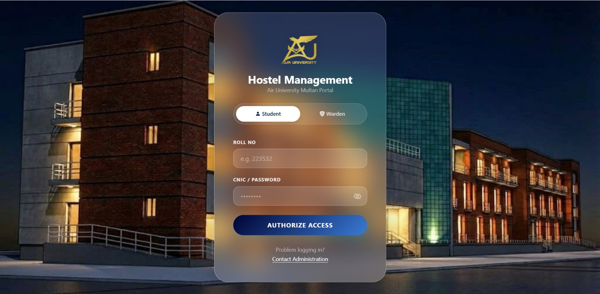
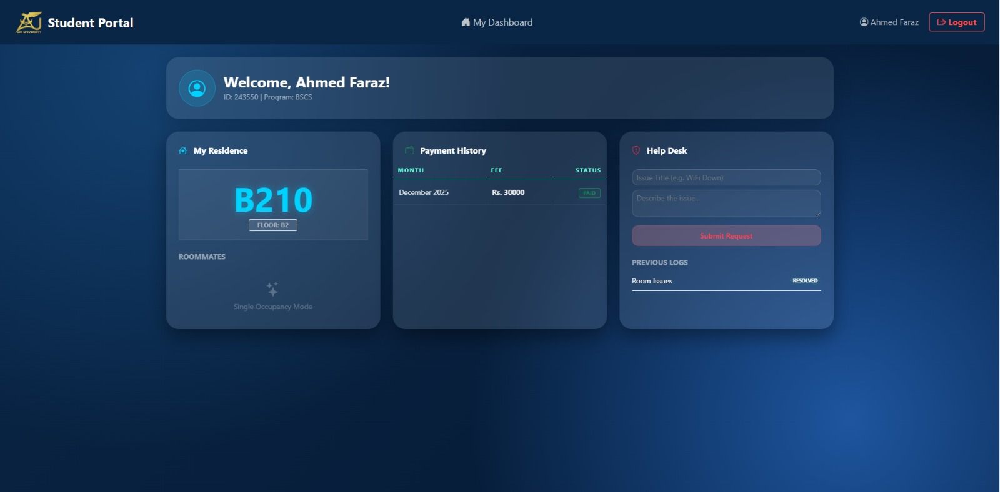

# 🏨 Hostel Management System (HMS)

### *A Modern, Automated Accommodation Portal for Air University*


## 📝 Introduction

The **Hostel Management System (HMS)** is a comprehensive digital solution developed to replace manual paper-based record-keeping in university hostels. Currently, there is no automated system in place at our university hostel; this project aims to fill that gap by providing a streamlined, secure, and transparent platform for both administrators (Wardens) and residents (Students).

---

## 🚀 Key Features

### **Warden Portal (Admin)**

* **Real-time Dashboard**: Monitor total residents, room occupancy, available beds, and pending complaints at a glance.
* **Student Management**: Full CRUD operations for student registration and room allocation.
* **Room Inventory**: Manage room capacities and floor assignments.
* **Fee Generation**: Automated monthly fee challan generation and payment verification.
* **Support Desk**: Resolve maintenance complaints filed by students.

### **Student Portal (Resident)**

* **Personal Dashboard**: View assigned room, floor details, and roommate information.
* **Fee History**: Track monthly payment status (Paid/Unpaid).
* **Help Desk**: Submit maintenance requests or complaints directly to the Warden.
* **Profile Settings**: Securely update contact information and passwords.

---

## 🛠️ Technical Stack

* **Backend**: C# / ASP.NET Core 8.0 MVC.
* **Database**: MS SQL Server.
* **ORM**: Entity Framework Core (Code-First).
* **Frontend**: HTML5, CSS3, JavaScript.
* **Styling**: Bootstrap 5 & Custom **Glassmorphism** (Navy Tech Theme).
* **Icons**: Bootstrap Icons.

---

## 📦 NuGet Packages & Dependencies

* **Microsoft.EntityFrameworkCore.SqlServer**: SQL Server database provider.
* **Microsoft.EntityFrameworkCore.Tools**: Migrations and database tooling.
* **Microsoft.AspNetCore.Session**: Session-based role authentication.
* **Microsoft.VisualStudio.Web.CodeGeneration.Design**: MVC scaffolding tools.

---

## 🏗️ System Architecture

The project follows a **Three-Tier Architecture** to ensure separation of concerns and scalability:

1. **Presentation Layer**: Dynamic Razor Views styled with high-saturation backdrop-blur effects.
2. **Logic Layer**: Controllers handling role-based session authentication and business logic.
3. **Data Layer**: SQL Server managed via EF Core migrations.

---

## 📊 Database Design

The system logic is built around the following core entities:

* **Student**: Links to Rooms and handles personal/academic data.
* **Room**: Manages bed capacity and occupancy limits.
* **FeeChallan**: Tracks financial transactions.
* **Complaint**: Manages support tickets and their statuses.

---

## 💻 Installation & Setup

1. **Clone the repository**:
```bash
git clone https://github.com/AhmedBinAmeer/HostelManagementSystem.git

```


2. **Configure Database**: Update the connection string in `appsettings.json`:
```json
"ConnectionStrings": {
  "DefaultConnection": "Server=(localdb)\\mssqllocaldb;Database=HostelDB;Trusted_Connection=True;"
}

```


3. **Apply Migrations**: Run the following command in the **Package Manager Console**:
```powershell
Update-Database

```


4. **Run Application**: Press `F5` in Visual Studio.

---

## 📸 Project Previews

| Login Portal | Warden Dashboard | Student Portal |
| :---: | :---: | :---: |
|  |  |  |


---

## 🎓 Programmer

**Ahmed Faraz **
** Wamiq Ejaz**
** Muhammad AbuBaker**
---


